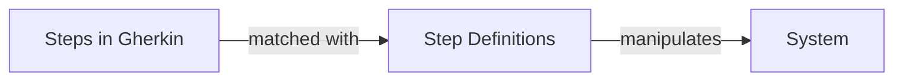

# vite-plugin-gherkin

`vite-plugin-gherkin` is a plugin for [Vitest](https://vitest.dev/) that enables you to run your Gherkin feature files as tests. This tool is an attempt to combine the best features of Cucumber/Gherkin with the paradigms and idioms of Vitest as a testing framework.

Check out [Cucumber](https://cucumber.io/) for more info regarding the Gherkin syntax.

## Getting Started

In your [Vitest configuration file](https://vitest.dev/config/), import and register a `vitePluginGherkin` instance. This will allow you to include Gherkin feature files in your test configuration. Also, don't forget to include your step definitions in your test setup:

```ts
import { vitePluginGherkin } from "vite-plugin-gherkin";
import { defineConfig } from "vitest/config";

export default defineConfig({
  plugins: [vitePluginGherkin()],
  test: {
    include: ["features/**/*.feature"],
    setupFiles: "features/step-definitions.ts",
  },
});
```

> [!NOTE]
> Because these will all run using the Vitest runner, both JavaScript and TypeScript are supported.

## Step Definitions

When you write tests with Gherkin, your feature files will have Gherkin steps. `vite-plugin-gherkin` will match these Gherkin steps with step definitions that you will implement to manipulate the system.



For an in-depth description on Gherkin and Behavior-Driven Development (BDD), please review [Cucumber's documentation](https://cucumber.io/docs/).

For example, a Gherkin file may have the following steps:

```gherkin
Scenario: I'm hungry
  Given I have 10 pickles
  When I eat 3 pickles
  Then I have 7 pickles left
```

In order for `vite-plugin-gherkin` to match Gherkin steps with step definitions, they need to be registered during test setup. This can be done by importing the registry functions `Given`, `When`, and/or `Then` from `vite-plugin-gherkin` and registering step patterns with an implementation.

```ts
import { Given, When, Then } from "vite-plugin-gherkin";

Given("I have {int} pickles", ([picklesOwned]) => {
  // ...
});

When("I eat {int} pickles", ([picklesToEat]) => {
  // ...
});

Then("I have {int} pickles left", ([expectedPickles]) => {
  // ...
});
```

`vite-plugin-gherkin` uses [Cucumber Expressions](https://github.com/cucumber/cucumber-expressions) and Regular Expressions for pattern matching. Similar to Vitest's [`test.for`](https://vitest.dev/api/#test-for), template output parameters are passed in order in an array as the 1st argument to the step implementation function.

### Sharing State between Steps

In order to track and share state between step definitions, `vite-plugin-gherkin` uses Vitest's [Test Context](https://vitest.dev/guide/test-context.html). Just like Vitest, you can [extend Test Context](https://vitest.dev/guide/test-context.html#extend-test-context) to setup and teardown fixtures to support your tests.

> [!IMPORTANT]
> When extending Test Context, your new test function must be exported as `test`.

For example, in JavaScript, you can define your `test-context.js` like so:

```js
import { test as base } from "vitest";

export const test = base.extend({
  pickles: ({}, use) => use({ count: 0 }),
});
```

Or in TypeScript, you can define your custom fixtures type and re-export `Given`, `When`, and `Then` for some additional type checking:

```ts
import { test as base } from "vitest";
import {
  Given as baseGiven,
  Then as baseThen,
  When as baseWhen,
  type RegisterStep,
} from "vite-plugin-gherkin";

export interface PickleFixtures {
  pickles: { count: number };
}

export const test = base.extend<PickleFixtures>({
  pickles: ({}, use) => use({ count: 0 }),
});

export const Given = baseGiven as RegisterStep<PickleFixtures>;
export const When = baseWhen as RegisterStep<PickleFixtures>;
export const Then = baseThen as RegisterStep<PickleFixtures>;
```

When extending Test Context, you must configure the `importTestFrom` option with your test context file:

```ts
import { vitePluginGherkin } from "vite-plugin-gherkin";
import { defineConfig } from "vitest/config";
import { path } from "path";

export default defineConfig({
  plugins: [
    vitePluginGherkin({
      importTestFrom: path.resolve(__dirname, "./features/test-context.ts"),
    }),
  ],
  test: {
    include: ["features/**/*.feature"],
    setupFiles: "features/step-definitions.ts",
  },
});
```

Sticking with the [`test.for`](https://vitest.dev/api/#test-for) analogy, step definition implementation functions will accept a 2nd argument which is the [`TestContext`](https://vitest.dev/guide/test-context.html) object.

> [!IMPORTANT]
> When injecting `TestContext` into a step definition, it must use the object destructuring pattern to communicate to Vitest which dependencies to resolve.

For example:

```ts
import { Given, When, Then } from "./test-context";

Given("I have {int} pickles", ([picklesOwned], { pickles }) => {
  pickles.count = picklesOwned;
});

When("I eat {int} pickles", ([picklesToEat], { pickles }) => {
  pickles.count -= picklesToEat;
});

Then("I have {int} pickles left", ([expectedPickles], { pickles }) => {
  if (pickles.count !== expectedPickles) {
    throw new Error("I don't have the right amount of pickles!");
  }
});
```
