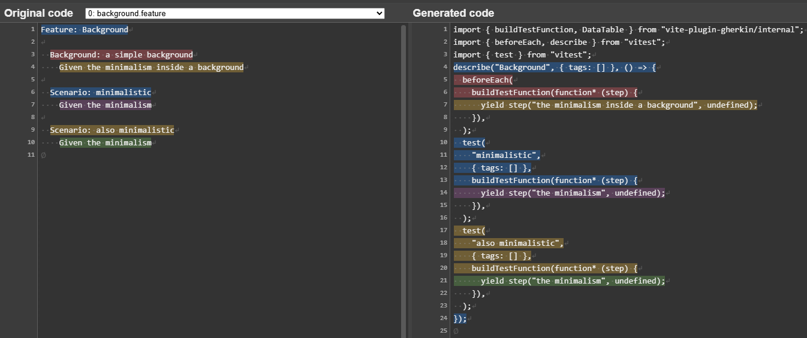

# Mappings

These mappings demonstrate how `vite-plugin-gherkin` transformers gherkin into Typescript. 
Each gherkin files can be viewed as a trio showing the gherkin, Typescript, and source map between the two. For example:

- [`background.feature`](./mappings/background.feature)
- [`background.test.ts`](./mappings/background.test.ts)
- [`background.test.ts.map`](./mappings/background.test.ts.map)

I recommend using [Source Map Visualizer](https://evanw.github.io/source-map-visualization/) to see the exact mappings

## Testing

These mappings don't only provide a mental model of how gherkin maps to vitest, but are verified through snapshot testing.

[`./mappings.test.ts`](./mappings.test.ts) will automatically pick up `.feature` files in the [`./mappings`](./mappings/) directory and generate the snapshots.

The generated `.test.ts` files can also be created and manually updated to help with TDD. 
I recommend letting the tool overwrite the source map snapshot and to test that by manually verifying in a visualizer.

### Note

After transforming the gherkin to Typescript, the test also runs it through eslint and applies autofixes with source maps. 
This makes it easier to read the snapshots and to manually update the `.test.ts` files since it uses the same eslint configuration as the project. (yes, very meta)

Because of this linting, the actual output from the transformer may differ slightly from these snapshots, but is functionally identical.

## Reference

The current feature files are a subset of valid gherkin files copied from https://github.com/cucumber/gherkin/tree/main/testdata/good
